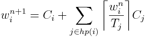

# # Exercise 9 - Scheduling

## Properties

### Task 1:
 **1. Why do we assign priorities to tasks?**
 Because sometimes we have differents tasks but one is more critical, or necessary to complete for the system to function correctly than the others, and it's better to assign higher priority to this one. Doing that we make sure that it is completed first in case the two tasks require same resources.
 
 **2. What features must a scheduler have for it to be usable for real-time systems?**
 For a scheduler to be useful in analysis of the system it needs to be predictable, so that it can finish tasks within certain deadlines. Especially for real-time systems, if a task is time critical, it will be useless if it's not scheduled properly. Furthermore, if a single task is taking to long, then the entire system can stop progressing. So fulfilling deadlines is especially important for real-time systems. 

 
## Inversion and inheritance

| Task | Priority   | Execution sequence | Release time |
|------|------------|--------------------|--------------|
| a    | 3          | `E Q V E`          | 4            |
| b    | 2          | `E V V E E E`      | 2            |
| c    | 1 (lowest) | `E Q Q Q E`        | 0            |

 - `E` : Executing
 - `Q` : Executing with resource Q locked
 - `V` : Executing with resource V locked

### Task 2: Draw Gantt charts to show how the former task set:
 **1. Without priority inheritance**
 
| Task | 0  | 1 | 2 | 3  | 4 | 5 | 6 | 7 | 8 | 9 | 10 | 11 | 12 | 13 | 14 |
|------|----|---|---|----|---|---|---|---|---|---|----|----|----|----|----|
| a    |    |   |   |    |  E|   |   |   |   |   |   Q|   V|   E|    |
| b    |    |   | E |   V|   |V  |  E|  E|  E|   |    |    |    |    |
| c    |E   |Q  |   |    |   |   |   |   |  Q|  Q|    |    |    |    |   E|

**2. With priority inheritance**
 
| Task | 0  | 1 | 2 | 3  | 4 | 5 | 6 | 7 | 8 | 9 | 10 | 11 | 12 | 13 | 14 |
|------|----|---|---|----|---|---|---|---|---|---|----|----|----|----|----|
| a    | |  |           ||E|||Q||V|E| |||
| b    |   |      | E          |V|||||V|||E|E|E|
| c    |E |  Q     |        | | |Q|Q| | | | | | | |E|

### Task 3: Explain:
 **1. What is priority inversion? What is unbounded priority inversion?**
 A priority inversion is when a high-priority process has to wait for a low-priority one to finish. This is because the lower priority task has been assigned recourses before the higher priority, and leaving that unable to be executed as intended. 
 An unbounded priority inversion is one that can cause the high priority process to wait forever, as lower priority tasks grant recourses to each other and ignorign the higher priority tasks indefinetly. Therefore, there is no guarantee that the higher priority tasks will even complete. 
  
 **3. Does priority inheritance avoid deadlocks?**
 No, it does not.
 

## Utilization and response time

### Task set 2:

*Task set 2:*

| Task | Period (T) | Exec. Time (C) |
|------|------------|----------------|
| a    | 50         | 15             |
| b    | 30         | 10             |
| c    | 20         | 5              |

### Task 4:
 **1. There are a number of assumptions / conditions that must be true for the utilization and response time tests to be usable (The "simple task model"). What are these assumptions? Comment on how realistic they are.**
 
 **2. Perform the utilization test for the task set. Is the task set schedulable?**
 
  
  
   
   
   The utilization test fails, the system may not be schedulable
 
 **3. Perform response-time analysis for the task set. Is the task set schedulable? If you got different results than in 2), explain why.**
 

The task is schedulable.
The utilization test is sufficient but not necessary.
The response time is necessary and sufficient.
 
 **4. (Optional) Draw a Gantt chart to show how the task set executes using rate monotonic priority assignment, and verify that your conclusions are correct.**

## Formulas

Utilization:  

Response-time:  

